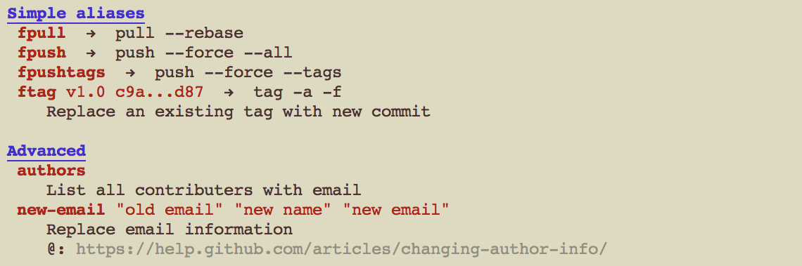

git-alias
=========

A command line tool that will display all registered git aliases.

`git-alias` runs with python 2 & 3 and should be compatible with macOS [tested], Linux, and Windows.




Example
-------
Try yourself:
```
python3 git-alias.py example.config
```

Or with the `gitconfig` from [GitAlias.com][1] (options used: `-vvq`)


Install
-------
Copy the `git-alias.py` to any path of your choosing, e.g., `/usr/local/bin`.

Extend your global `~/.gitconfig` file `alias` section:

```
[alias]
  # Show this message (help: -h)
  # !: ignore, inline
  alias = !python3 /usr/local/bin/git-alias.py
```

Python version and paths may differ!

Done.


Usage
-----
Run `git alias [options] [FILE]` or simply `git alias`.


### Output Options
- `-a`         Print all aliases, including hidden ones
- `--color`    Force colorful output
- `--no-color` Disable colorful output

### Verbosity Options
- `-q`    Don't print alias descriptions
- `-qq`   Also don't print section titles
- `-qqq`  Also don't print (inline) commands
- `-qqqq` Also don't print usage help
- `-v`    Print all multiline commands (unmodified)
- `-vv`   Print multiline commands using pretty print
- `-vvqq` Print just the alias and command in pretty format

### Config file
- If `[FILE]` not provided, will default to `~/.gitconfig`


[1]: https://github.com/gitalias/gitalias/blob/master/gitalias.txt